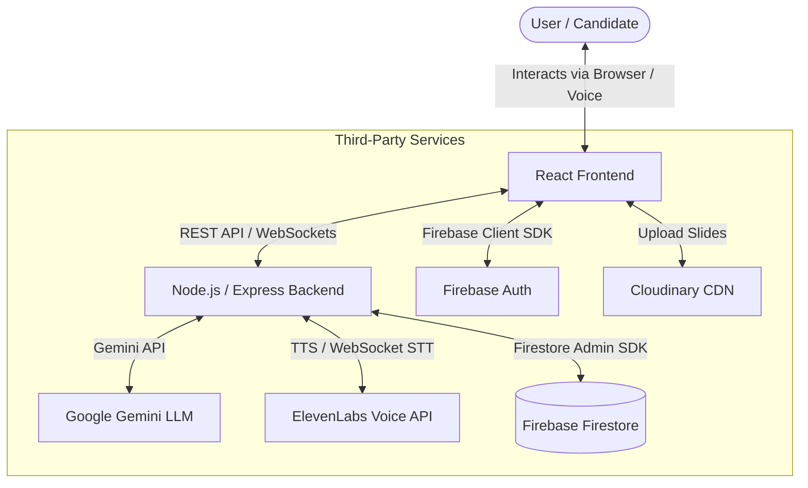
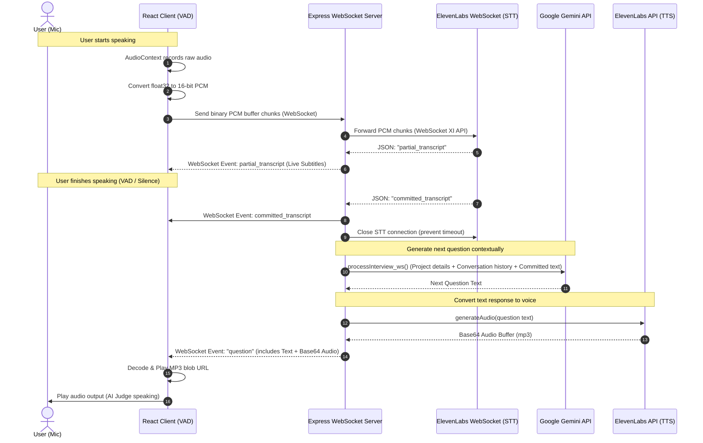
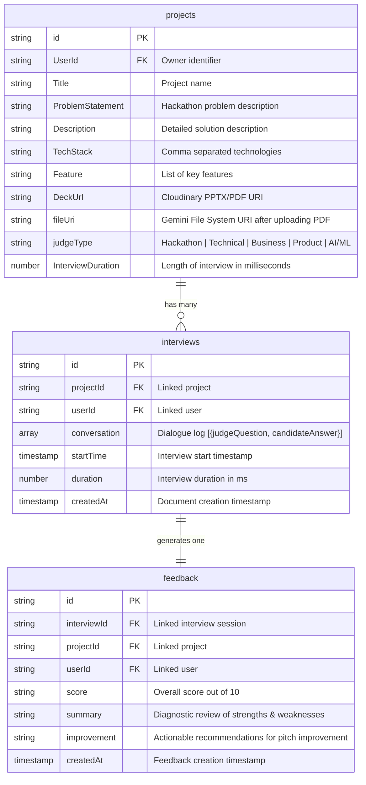

# System Architecture - HackJudge (PitchPerfect AI)

This document provides a comprehensive overview of the architecture of **HackJudge (PitchPerfect AI)**. It details the system boundaries, container relationships, real-time data flows for voice processing, database schema, and component breakdowns.

---

## 📌 System Context (Level 1)

The system consists of the client React application, backend Express/WS server, and external third-party APIs (Google Gemini, ElevenLabs, Firebase, Cloudinary).



---

## 🏗️ Container Architecture (Level 2)

A deeper look into how the client and server components communicate and manage system operations.

```mermaid
graph TB
    subgraph Client (Vite + React 19)
        LP[Landing & Login Pages]
        DP[Dashboard & History]
        MIF[Project Form & Upload]
        IRP[Interview Room Page]
        AM[Audio Manager: AudioContext / Worklet]
    end

    subgraph Server (Node.js + Express)
        Router[Express Router]
        WSS[WebSocket Server]
        
        subgraph Controllers
            StartInt[startInterview Controller]
            Finalize[finalizeSummary Controller]
            ProjDet[ProjectDetail Controller]
        end

        subgraph Real-Time Socket Handlers
            STT[SpeechToText Handler]
            QA[processInterview_ws Handler]
            TTS[generatingAudio Handler]
        end
    end

    subgraph Database & Cloud
        FS[(Firestore Collections)]
        CL[Cloudinary Storage]
    end

    subgraph AI & Audio Engines
        GeminiEngine[Google GenAI Gemini]
        ElevenLabsEngine[ElevenLabs STT / TTS]
    end

    %% Client Interactions
    MIF -->|1. Submit Metadata| Router
    MIF -->|2. Upload Slide Deck| CL
    IRP -->|3. Establish WebSocket connection| WSS
    AM -->|4. Stream PCM 16-bit audio| WSS

    %% Server Controller Operations
    Router --> ProjDet
    Router --> StartInt
    Router --> Finalize
    
    ProjDet -->|Write Project| FS
    StartInt -->|Initial Prompt / Create Session| FS
    StartInt -->|Fetch Deck & Upload| GeminiEngine
    StartInt -->|Generate Audio| ElevenLabsEngine
    Finalize -->|Evaluate & Save Scorecard| FS
    Finalize -->|Review Interview| GeminiEngine

    %% Socket Operations
    WSS --> STT
    STT -->|Proxy PCM Audio| ElevenLabsEngine
    ElevenLabsEngine -->|Partial / Committed Transcript| STT
    STT -->|Transcript| QA
    QA -->|Prompt + Conversation History| GeminiEngine
    GeminiEngine -->|Next Question Text| QA
    QA -->|Synthesize Question| TTS
    TTS -->|TTS Request| ElevenLabsEngine
    TTS -->|Base64 Audio Buffer| STT
    STT -->|Websocket Event: question + audio| IRP
```

---

## 🔄 Real-Time Voice Dialogue Loop (Sequence Diagram)

During a live mock interview, the system orchestrates raw audio capture, transcription, conversational AI responses, and speech synthesis over WebSocket channels.



---

## 💾 Database Schema (Firebase Firestore)

HackJudge models its data in three core collections:



---

## 🔧 Component Overview

### 1. Client Applications Pages & Components
- **`LandingPage.jsx`**: Welcomes the user, explains key benefits of HackJudge.
- **`LoginPage.jsx` / `SignupPage.jsx`**: Handles authentication workflows leveraging Firebase.
- **`DashboardPage.jsx`**: Displays a user's projects, lists historical attempts, highlights scorecard metrics, and manages deleting or updating entries.
- **`MockInterviewForm.jsx`**: Gathers target mock judging parameters: project title, description, features list, tech stack, and slide presentation (PDF upload to Cloudinary).
- **`InterviewRoomPage.jsx`**: Orchestrates the live voice room. Initializes the custom audio graph using `audio-processor.js` via an `AudioWorkletNode` to downsample to 16kHz PCM on-the-fly, establishes a WebSocket connection, monitors session timers, and controls audio playing blobs.

### 2. Server Modules
- **`webSocket.js`**: Mounts `/interview` endpoint to capture WebSocket requests, loads state from Firestore, and initiates the Speech-to-Text session.
- **`Socket/SpeechToText.js`**: Creates a proxy gateway. Pipes raw mic streams from the client browser straight to ElevenLabs' Real-time STT WebSocket. On receiving a committed segment, it triggers the question model update and audio creation.
- **`Socket/processInterview_ws.js`**: Communicates with the Google GenAI SDK. Assembles a tailored prompt incorporating judge persona traits (`judgeConfig.js`), project details, uploaded slide files, and historical conversation arrays to output the next judging question.
- **`Socket/generatingAudio.js`**: Integrates with ElevenLabs' HTTP text-to-speech REST interface. Produces realistic voice sound bites for the judge's generated questions.
- **`controller/startInterview.js`**: Initial setup handler. Downloads project presentation decks from Cloudinary to a temporary PDF, uploads the file onto Gemini space for semantic referencing, generates the initial greeting/question, compiles the first audio snippet, and stores the initial record inside Firestore.
- **`controller/finalizeSummary.js`**: Post-interview analysis handler. Requests Gemini to analyze the complete dialogue log, requests feedback formatted strictly to a JSON schema, records it in the `feedback` table, and ends the session.
